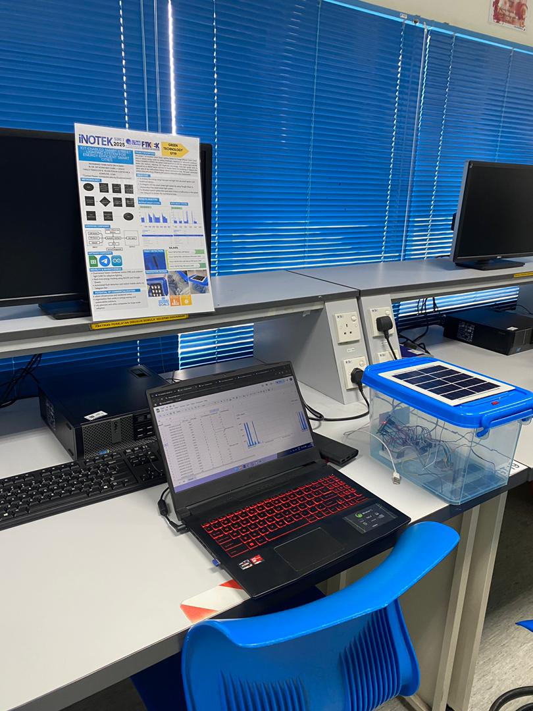
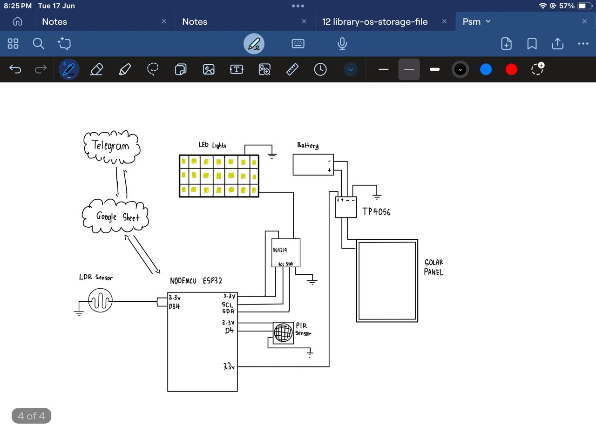
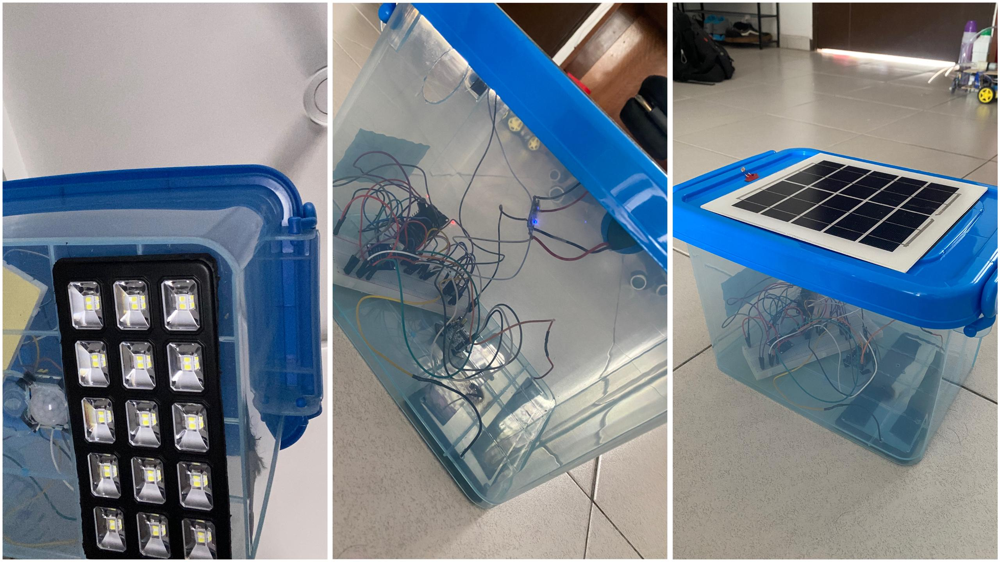
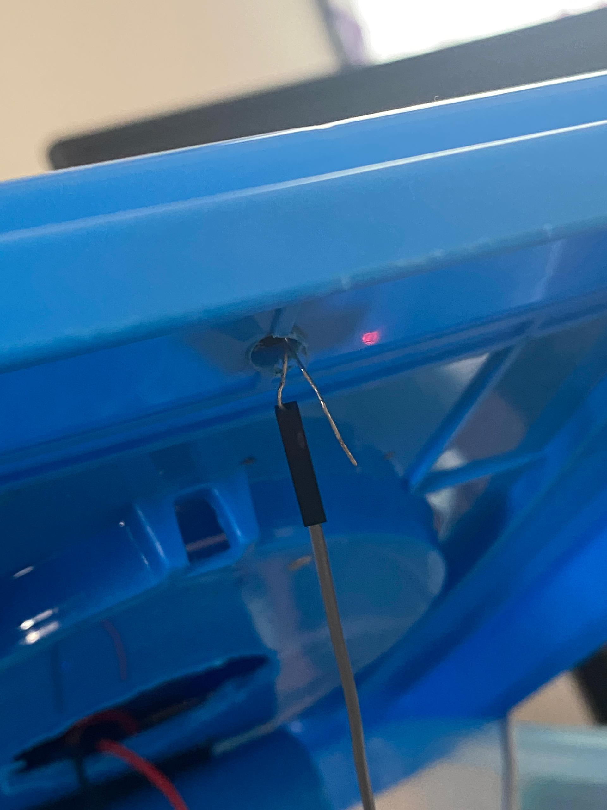
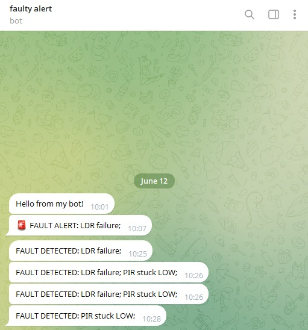
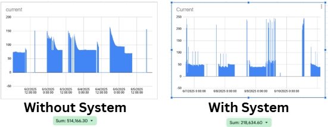

# IoT-Enabled Smart Street Lighting System for Energy-Efficient Smart Cities  

## 📌 Project Overview  
This project focuses on developing a **smart street lighting system** that improves **energy efficiency** and supports **smart city infrastructure**. The system intelligently manages LED street lights using IoT-based technology, reducing unnecessary energy consumption while ensuring public safety.  

## ⚡ Key Features  
- **IoT Integration** – Street lights are connected through IoT modules for real-time monitoring and control.  
- **Energy Comparison** – Evaluates power consumption between **regular LED lights** and **smart IoT-enabled LED lights**.  
- **Fault Detection & Alerts** – A centralized controller detects malfunctioning street lights and sends **instant alerts via Telegram Bot**.  
- **Automation** – Lights can automatically adjust based on environmental conditions, reducing wastage.  
- **Scalability** – Designed to be expandable for city-wide deployment.  

## 🛠️ Technologies Used  
- **Hardware**: LED lights, IoT sensors/modules (e.g., LDR, NodeMCU/ESP8266/ESP32, relay module)  
- **Software**: Arduino IDE / Embedded C for microcontroller programming  
- **Backend**: IoT cloud platform (or MQTT protocol for communication)  
- **Alerts**: Telegram Bot API for real-time notifications  
- **Data Monitoring**: Energy usage comparison recorded for analysis  

## 🚦 How It Works  
1. **Sensing & Control** – IoT sensors detect ambient light levels and automatically switch street lights ON/OFF.  
2. **Fault Monitoring** – When a light malfunctions, the system identifies the faulty node.  
3. **Alert System** – A **Telegram Bot** instantly notifies the maintenance team of the issue.  
4. **Energy Analysis** – Data is collected to compare traditional LEDs with the smart IoT-enabled system.  

## 🏗️ System Architecture  
Here’s the system workflow and design:  

  
  
  
  
  

## 🎯 Objectives  
- Reduce **energy consumption** in urban areas.  
- Provide a **sustainable and smart infrastructure** for future cities.  
- Enable **real-time monitoring** and **quick response** to faults.  

## 📊 Results (Expected/Observed)  
- Significant **energy savings** with smart control.  
- Faster fault detection and repair due to automated alerts.  
- Potential for large-scale deployment in smart city projects.  
